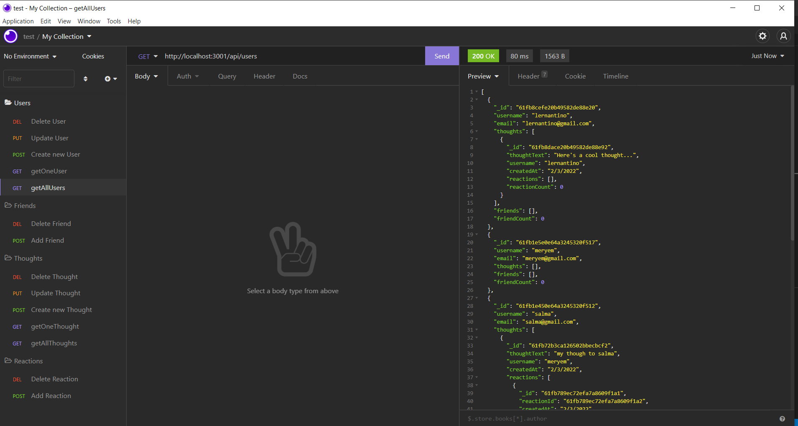
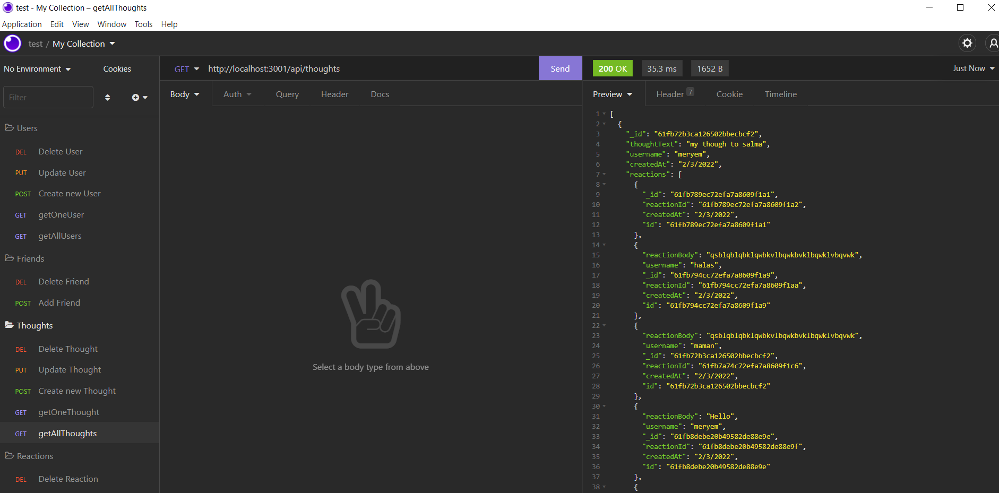

# Social-Network-API

  ## Description:
The Application requires to build an API for a social network web application where users can share their thoughts, react to friends’ thoughts, and create a friend list.

  ## User Story

```md
AS A social media startup
I WANT an API for my social network that uses a NoSQL database
SO THAT my website can handle large amounts of unstructured data
```

  ## Table of Contents 
  - [Installation](#installation)
  - [Usage](#usage)
  - [License](#license)
  - [ScreenShot](#screenShot)
  - [Links](#links)
  - [Questions](#questions)
  - [Copyright](#copyright)
  ## Installation
  to install dependencies , run this following command :
``` 
 npm i
 ```
  ## Usage
The User needs to clone first the repo then install dependencies by runing the following command :

 ``` 
node server.js
 ```


  ## License
  this Project is licensed under **ISC** license.
  
  ## ScreenShot 

User routes :
   

Though routes:
   

  ## Links

  * The URL of the GitHub repository : https://github.com/MERYEM-AD/Social-Network-API

  * You can view a walkthrough video of the app  :  [here]()
  
  ## Questions
  iF you have any questions about the repo you can contact me by email : adiri.meryem.mw@gmail.com.

  Follow me on [my Github account](https://github.com/MERYEM-AD).
  ## Copyright
 
```
Copyright 2021 , Meryem Adiri.

Permission to use, copy, modify, and/or distribute this software for any purpose with or without fee is hereby granted, provided that the above copyright notice and this permission notice appear in all copies.

THE SOFTWARE IS PROVIDED "AS IS" AND THE AUTHOR DISCLAIMS ALL WARRANTIES WITH REGARD TO THIS SOFTWARE INCLUDING ALL IMPLIED WARRANTIES OF MERCHANTABILITY AND FITNESS. IN NO EVENT SHALL THE AUTHOR BE LIABLE FOR ANY SPECIAL, DIRECT, INDIRECT, OR CONSEQUENTIAL DAMAGES OR ANY DAMAGES WHATSOEVER RESULTING FROM LOSS OF USE, DATA OR PROFITS, WHETHER IN AN ACTION OF CONTRACT, NEGLIGENCE OR OTHER TORTIOUS ACTION, ARISING OUT OF OR IN CONNECTION WITH THE USE OR PERFORMANCE OF THIS SOFTWARE.

```
